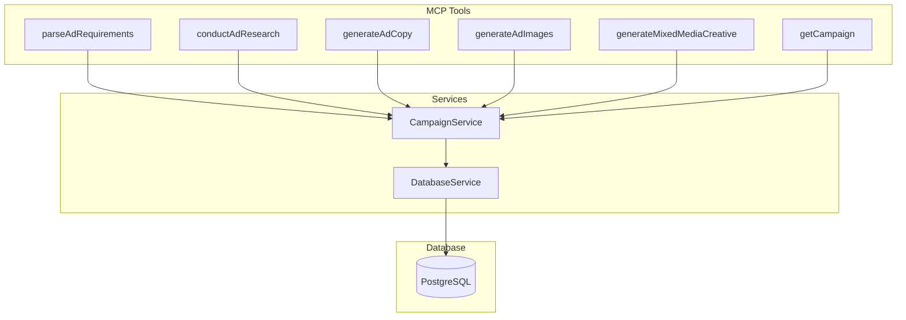
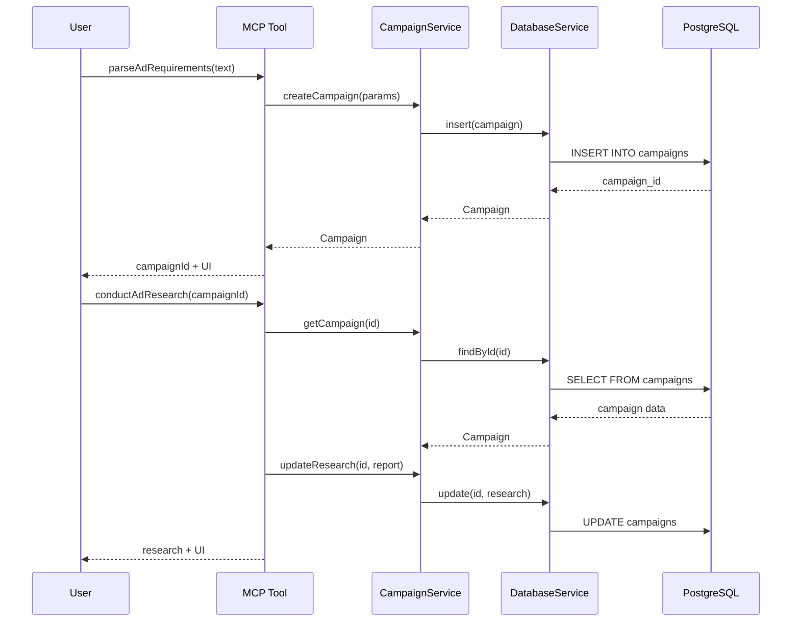

# Design Document: Campaign Data Persistence

## Overview

This feature adds PostgreSQL-based data persistence to the FeedMob AdPilot MCP tools, enabling campaign information to flow between tool calls using a unique campaign ID. The system stores all campaign artifacts (parameters, research, ad copy, images, mixed media) in a single `campaigns` table using JSONB columns for flexible schema storage.

## Architecture



### Data Flow



## Components and Interfaces

### 1. DatabaseService (`src/services/database.ts`)

Manages PostgreSQL connection pool and provides low-level database operations.

```typescript
interface DatabaseService {
  // Connection management
  connect(): Promise<void>;
  disconnect(): Promise<void>;
  isConnected(): boolean;
  
  // Query execution
  query<T>(sql: string, params?: unknown[]): Promise<T[]>;
  queryOne<T>(sql: string, params?: unknown[]): Promise<T | null>;
  
  // Transaction support
  transaction<T>(fn: (client: PoolClient) => Promise<T>): Promise<T>;
  
  // Health check
  healthCheck(): Promise<boolean>;
}
```

### 2. CampaignService (`src/services/campaign.ts`)

Business logic layer for campaign CRUD operations with typed interfaces.

```typescript
interface CampaignService {
  // Create
  createCampaign(params: CampaignParameters): Promise<Campaign>;
  
  // Read
  getCampaign(id: string): Promise<Campaign | null>;
  getCampaignOrThrow(id: string): Promise<Campaign>;
  
  // Update individual components
  updateParameters(id: string, params: CampaignParameters): Promise<Campaign>;
  updateResearch(id: string, report: CampaignReport): Promise<Campaign>;
  updateAdCopy(id: string, result: AdCopyResult): Promise<Campaign>;
  updateImages(id: string, result: AdImagesResult): Promise<Campaign>;
  updateMixedMedia(id: string, result: MixedMediaResult): Promise<Campaign>;
  
  // Selection tracking
  selectAdCopyVariation(id: string, variation: 'A' | 'B'): Promise<Campaign>;
  selectImageVariation(id: string, variation: 'A' | 'B'): Promise<Campaign>;
}
```

### 3. Updated Tool Schemas

Each tool's input schema will be extended to accept an optional `campaignId`:

```typescript
// parseAdRequirements - optional campaignId for updates
const ParseAdRequirementsInputSchema = z.object({
  requestText: z.string().min(1),
  campaignId: z.string().uuid().optional()
});

// Other tools - required campaignId OR inline data
const ConductAdResearchInputSchema = z.object({
  campaignId: z.string().uuid().optional(),
  campaignParameters: CampaignParametersSchema.optional()
}).refine(
  data => data.campaignId || data.campaignParameters,
  { message: 'Either campaignId or campaignParameters must be provided' }
);
```

### 4. New getCampaign Tool (`src/tools/get-campaign.ts`)

Retrieves complete campaign data for review.

```typescript
const getCampaignTool = {
  name: 'getCampaign',
  description: 'Retrieve complete campaign data including all generated assets',
  parameters: z.object({
    campaignId: z.string().uuid()
  }),
  execute: async (args) => {
    const campaign = await campaignService.getCampaignOrThrow(args.campaignId);
    return createCampaignUI(campaign);
  }
};
```

## Data Models

### Campaign Entity

```typescript
interface Campaign {
  // Identity
  id: string;                              // UUID primary key
  
  // Campaign data (JSONB columns)
  parameters: CampaignParameters | null;   // From parseAdRequirements
  research: CampaignReport | null;         // From conductAdResearch
  ad_copy: AdCopyResult | null;            // From generateAdCopy
  images: AdImagesResult | null;           // From generateAdImages
  mixed_media: MixedMediaResult | null;    // From generateMixedMediaCreative
  
  // User selections
  selected_ad_copy_variation: 'A' | 'B' | null;
  selected_image_variation: 'A' | 'B' | null;
  
  // Timestamps
  created_at: Date;
  updated_at: Date;
  
  // Component timestamps (for tracking progress)
  parameters_updated_at: Date | null;
  research_updated_at: Date | null;
  ad_copy_updated_at: Date | null;
  images_updated_at: Date | null;
  mixed_media_updated_at: Date | null;
}
```

### Database Schema

```sql
CREATE TABLE campaigns (
  id UUID PRIMARY KEY DEFAULT gen_random_uuid(),
  
  -- Campaign data as JSONB for flexible schema
  parameters JSONB,
  research JSONB,
  ad_copy JSONB,
  images JSONB,
  mixed_media JSONB,
  
  -- User selections
  selected_ad_copy_variation VARCHAR(1) CHECK (selected_ad_copy_variation IN ('A', 'B')),
  selected_image_variation VARCHAR(1) CHECK (selected_image_variation IN ('A', 'B')),
  
  -- Timestamps
  created_at TIMESTAMPTZ NOT NULL DEFAULT NOW(),
  updated_at TIMESTAMPTZ NOT NULL DEFAULT NOW(),
  parameters_updated_at TIMESTAMPTZ,
  research_updated_at TIMESTAMPTZ,
  ad_copy_updated_at TIMESTAMPTZ,
  images_updated_at TIMESTAMPTZ,
  mixed_media_updated_at TIMESTAMPTZ
);

-- Index for efficient lookups
CREATE INDEX idx_campaigns_id ON campaigns(id);

-- Trigger to auto-update updated_at
CREATE OR REPLACE FUNCTION update_updated_at_column()
RETURNS TRIGGER AS $$
BEGIN
  NEW.updated_at = NOW();
  RETURN NEW;
END;
$$ language 'plpgsql';

CREATE TRIGGER update_campaigns_updated_at
  BEFORE UPDATE ON campaigns
  FOR EACH ROW
  EXECUTE FUNCTION update_updated_at_column();
```

### Zod Schema for Campaign

```typescript
// src/schemas/campaign.ts
export const CampaignSchema = z.object({
  id: z.string().uuid(),
  parameters: CampaignParametersSchema.nullable(),
  research: CampaignReportSchema.nullable(),
  ad_copy: AdCopyResultSchema.nullable(),
  images: AdImagesResultSchema.nullable(),
  mixed_media: MixedMediaResultSchema.nullable(),
  selected_ad_copy_variation: z.enum(['A', 'B']).nullable(),
  selected_image_variation: z.enum(['A', 'B']).nullable(),
  created_at: z.coerce.date(),
  updated_at: z.coerce.date(),
  parameters_updated_at: z.coerce.date().nullable(),
  research_updated_at: z.coerce.date().nullable(),
  ad_copy_updated_at: z.coerce.date().nullable(),
  images_updated_at: z.coerce.date().nullable(),
  mixed_media_updated_at: z.coerce.date().nullable()
});

export type Campaign = z.infer<typeof CampaignSchema>;
```


## Correctness Properties

*A property is a characteristic or behavior that should hold true across all valid executions of a system-essentially, a formal statement about what the system should do. Properties serve as the bridge between human-readable specifications and machine-verifiable correctness guarantees.*

### Property 1: Campaign Creation Generates Valid UUID
*For any* valid campaign parameters, when stored without a campaign ID, the system shall generate a valid UUID v4 and return it in the response.
**Validates: Requirements 1.1**

### Property 2: Campaign Update Preserves ID
*For any* existing campaign, when updated with new parameters using its campaign ID, the campaign ID shall remain unchanged and the parameters shall be updated.
**Validates: Requirements 1.2**

### Property 3: Campaign ID Present in Response
*For any* successful campaign storage operation, the campaign ID shall be present in both the text response and the UI resource content.
**Validates: Requirements 1.3**

### Property 4: Timestamps Recorded on Storage
*For any* stored campaign, the created_at and updated_at timestamps shall be valid ISO datetime strings, and updated_at shall be greater than or equal to created_at.
**Validates: Requirements 1.4**

### Property 5: Invalid Campaign ID Returns Not Found
*For any* non-existent UUID provided as campaign ID, the system shall return an error indicating the campaign was not found.
**Validates: Requirements 1.6, 2.3, 6.3**

### Property 6: Campaign Parameters Round-Trip
*For any* valid campaign parameters, storing and then retrieving by campaign ID shall return parameters equal to the original.
**Validates: Requirements 2.1**

### Property 7: Research Storage and Retrieval
*For any* valid campaign report, storing it linked to a campaign ID and then retrieving shall return a report equal to the original.
**Validates: Requirements 2.2**

### Property 8: Inline Parameters Override Stored
*For any* campaign with stored parameters, when conductAdResearch is called with both campaign ID and inline parameters, the inline parameters shall be used and stored.
**Validates: Requirements 2.4**

### Property 9: Ad Copy Retrieves Parameters and Research
*For any* campaign with both parameters and research stored, generateAdCopy shall retrieve both when called with the campaign ID.
**Validates: Requirements 3.1**

### Property 10: Ad Copy Storage Round-Trip
*For any* valid ad copy result, storing and retrieving by campaign ID shall preserve all fields including headline, body_copy, cta, and recommendation.
**Validates: Requirements 3.2, 3.4**

### Property 11: Ad Copy Generation Without Research
*For any* campaign with parameters but no research, generateAdCopy shall successfully generate ad copy using only the parameters.
**Validates: Requirements 3.3**

### Property 12: Images Retrieve All Prior Components
*For any* campaign with parameters, research, and ad copy stored, generateAdImages shall retrieve all three when called with the campaign ID.
**Validates: Requirements 4.1**

### Property 13: Image Storage Round-Trip
*For any* valid image result, storing and retrieving by campaign ID shall preserve all fields including image URLs, dimensions, and metadata.
**Validates: Requirements 4.2**

### Property 14: Ad Copy Selection Persisted
*For any* ad copy variation selection ('A' or 'B'), storing the selection and retrieving the campaign shall return the same selection.
**Validates: Requirements 4.3**

### Property 15: Mixed Media Retrieves Selected Assets
*For any* campaign with selected image and ad copy, generateMixedMediaCreative shall retrieve both when called with the campaign ID.
**Validates: Requirements 5.1**

### Property 16: Mixed Media Storage Round-Trip
*For any* valid mixed media result, storing and retrieving by campaign ID shall preserve the composite URL, dimensions, and source variation references.
**Validates: Requirements 5.2, 5.4**

### Property 17: getCampaign Returns All Components
*For any* campaign with all components stored, getCampaign shall return all components in a single response.
**Validates: Requirements 6.1**

### Property 18: Component Timestamps Present
*For any* campaign with components stored, each component shall have its own timestamp indicating when it was last updated.
**Validates: Requirements 6.2**

### Property 19: Completion Status Derivable
*For any* campaign, the completion status of each component shall be derivable from whether the component data is null or present.
**Validates: Requirements 6.4**

### Property 20: Schema Validation on Retrieval
*For any* data retrieved from the database, it shall pass validation against the corresponding Zod schema.
**Validates: Requirements 8.2**

## Error Handling

### Database Connection Errors

When database operations fail, the system shall:
1. Log the error with full context (operation, campaign ID, error message)
2. Return a user-friendly error message
3. For parseAdRequirements, still return the extracted parameters even if storage fails
4. Use exponential backoff for transient failures (connection pool exhaustion)

### Error Types

```typescript
class CampaignNotFoundError extends Error {
  constructor(campaignId: string) {
    super(`Campaign not found: ${campaignId}`);
    this.name = 'CampaignNotFoundError';
  }
}

class DatabaseConnectionError extends Error {
  constructor(message: string) {
    super(`Database connection failed: ${message}`);
    this.name = 'DatabaseConnectionError';
  }
}

class MissingAssetsError extends Error {
  constructor(campaignId: string, missingAssets: string[]) {
    super(`Campaign ${campaignId} is missing required assets: ${missingAssets.join(', ')}`);
    this.name = 'MissingAssetsError';
  }
}
```

### Error Response Format

Tools shall return errors in a consistent format:

```typescript
{
  content: [
    { type: 'text', text: 'Error: Campaign not found: abc-123' },
    createErrorUI(error, 'not_found')
  ]
}
```

## Testing Strategy

### Unit Tests

Unit tests will cover:
- DatabaseService connection management
- CampaignService CRUD operations with mocked database
- Schema validation for Campaign entity
- Error handling for each error type

### Property-Based Tests

Using **fast-check** library with minimum 100 iterations per property:

1. **Round-trip properties**: Store → Retrieve → Compare for each data type
2. **Schema validation**: All retrieved data passes Zod validation
3. **Timestamp invariants**: updated_at >= created_at, component timestamps present when data exists
4. **ID generation**: All generated IDs are valid UUID v4
5. **Selection persistence**: Variation selections survive round-trip

Each property-based test will be tagged with:
```typescript
// **Feature: campaign-data-persistence, Property 6: Campaign Parameters Round-Trip**
// **Validates: Requirements 2.1**
```

### Integration Tests

Integration tests will verify:
- Full workflow from parseAdRequirements through generateMixedMediaCreative
- Database migrations run correctly
- Connection pool behavior under load
- Error recovery scenarios

### Test Database Setup

Tests will use a separate test database:
```typescript
// vitest.setup.ts
beforeAll(async () => {
  await db.connect(process.env.TEST_DATABASE_URL);
  await db.migrate();
});

afterEach(async () => {
  await db.query('TRUNCATE campaigns CASCADE');
});

afterAll(async () => {
  await db.disconnect();
});
```
