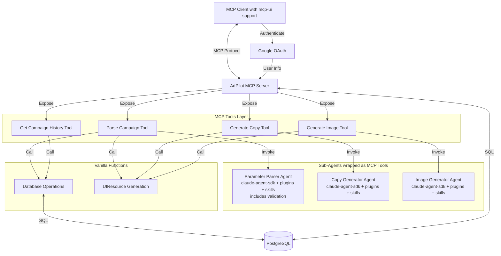
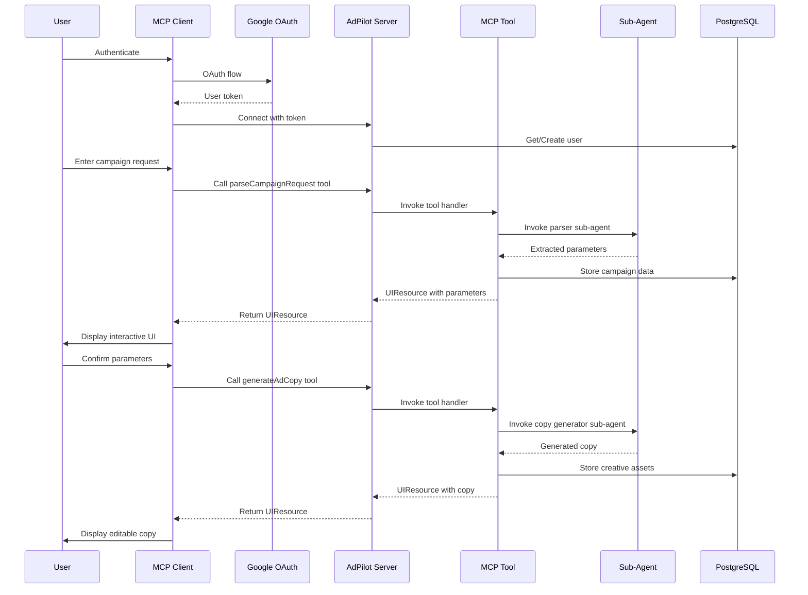

# Design Document

## Overview

The FeedMob AdPilot MCP system is a conversational advertising assistant built as an MCP server that helps advertisers create comprehensive ad campaigns through natural language interaction. The system leverages the Model Context Protocol ecosystem to provide an interactive, component-based UI experience while orchestrating multiple specialized sub-agents for different aspects of ad creation.

The architecture follows a modular design with clear separation between:
- **Transport Layer**: HTTP/SSE-based MCP communication
- **MCP Tools Layer**: MCP tools and prompts that orchestrate sub-agents or vanilla functions
- **Agent Orchestration**: Sub-agents built using claude-agent-sdk + plugins + agent skills, wrapped as MCP tools
- **UI Rendering**: Interactive components via mcp-ui
- **Data Persistence**: PostgreSQL for users, campaigns, and asset storage
- **Authentication**: Google OAuth for user authentication
- **Chat Interface**: Conversational UI through scira-mcp-ui-chat

## Architecture

### High-Level Architecture



### Component Interaction Flow



## Components and Interfaces

### 1. MCP Server Core

**Responsibilities:**
- Handle MCP protocol communication via StreamableHTTPServerTransport
- Register and expose MCP tools
- Manage sub-agent lifecycle and invocation
- Coordinate between different system components

**Key Interfaces:**
```typescript
interface AdPilotServer {
  // MCP server instance
  server: Server;
  
  // Tool handlers
  parseCampaignRequest(input: string): Promise<CampaignParameters>;
  generateAdCopy(params: CampaignParameters): Promise<AdCopy>;
  generateAdImages(params: CampaignParameters): Promise<ImageAsset[]>;
  generateMixedMedia(params: CampaignParameters): Promise<MixedMediaAsset>;
  
  // Sub-agent management
  invokeSubAgent(agentType: string, prompt: string, context: any): Promise<any>;
}
```

### 2. MCP Tools Layer

**Responsibilities:**
- Expose MCP tools that orchestrate sub-agents or vanilla functions
- Handle tool invocation from MCP clients
- Route requests to appropriate sub-agents or functions
- Aggregate and format responses

**MCP Tools:**
- **parseCampaignRequest**: Invokes Parameter Parser sub-agent (includes inline validation)
- **generateAdCopy**: Invokes Copy Generator sub-agent
- **generateAdImages**: Invokes Image Generator sub-agent
- **generateMixedMedia**: Invokes Image Generator sub-agent with copy overlay
- **getCampaignHistory**: Calls vanilla database function

**Key Interfaces:**
```typescript
interface MCPToolDefinition {
  name: string;
  description: string;
  inputSchema: JSONSchema;
  handler: (input: any, context: ToolContext) => Promise<any>;
}

interface ToolContext {
  userId: string;
  sessionId: string;
}
```

### 3. Sub-Agent Orchestrator

**Responsibilities:**
- Build sub-agents using claude-agent-sdk + plugins + agent skills
- Wrap sub-agents as callable functions for MCP tools
- Manage sub-agent lifecycle and configuration

**Sub-Agent Types:**
- **Parameter Parser Agent**: Built with claude-agent-sdk, uses NLP skills to extract structured data and validate budget/platform combinations
- **Copy Generator Agent**: Built with claude-agent-sdk, uses creative writing skills and platform-specific plugins
- **Image Generator Agent**: Built with claude-agent-sdk, uses image generation plugins

**Key Interfaces:**
```typescript
interface SubAgentConfig {
  name: string;
  description: string;
  instructions: string;
  plugins: string[];
  skills: string[];
  model?: string;
}

interface SubAgentWrapper {
  buildAgent(config: SubAgentConfig): Promise<Agent>;
  wrapAsMCPTool(agent: Agent): MCPToolDefinition;
  invoke(agent: Agent, input: any): Promise<any>;
}
```

### 4. UI Resource Generator

**Responsibilities:**
- Create UIResource objects using @mcp-ui/server
- Format data for interactive display
- Handle metadata and rendering preferences

**Key Interfaces:**
```typescript
interface UIResourceGenerator {
  createParameterDisplay(params: CampaignParameters): UIResource;
  createCopyDisplay(copy: AdCopy): UIResource;
  createImageDisplay(images: ImageAsset[]): UIResource;
  createMixedMediaDisplay(asset: MixedMediaAsset): UIResource;
}
```

### 5. Authentication Layer

**Responsibilities:**
- Handle Google OAuth authentication flow
- Manage user sessions and tokens
- Provide user information to MCP tools

**Key Interfaces:**
```typescript
interface AuthService {
  initiateOAuth(): Promise<string>; // Returns OAuth URL
  handleOAuthCallback(code: string): Promise<User>;
  validateToken(token: string): Promise<User>;
  refreshToken(refreshToken: string): Promise<string>;
}

interface User {
  id: string;
  email: string;
  name: string;
  picture?: string;
  createdAt: Date;
}
```

### 6. Database Layer

**Responsibilities:**
- Persist user information from Google OAuth
- Persist campaign parameters and creative assets
- Provide campaign history and retrieval
- Handle connection failures gracefully

**Key Interfaces:**
```typescript
interface DatabaseService {
  // User operations
  createUser(user: User): Promise<string>;
  getUser(userId: string): Promise<User>;
  getUserByEmail(email: string): Promise<User | null>;
  updateUser(userId: string, updates: Partial<User>): Promise<void>;
  
  // Campaign operations
  saveCampaign(userId: string, params: CampaignParameters): Promise<string>;
  saveCreativeAsset(campaignId: string, asset: CreativeAsset): Promise<string>;
  getCampaignHistory(userId: string): Promise<Campaign[]>;
  getCampaign(campaignId: string): Promise<Campaign>;
}
```

### 7. Chat Interface Integration

**Responsibilities:**
- Render conversational UI using scira-mcp-ui-chat
- Embed UIResource components within chat flow
- Maintain conversation history

**Key Interfaces:**
```typescript
interface ChatIntegration {
  sendMessage(message: string): void;
  displayUIResource(resource: UIResource): void;
  getConversationHistory(): Message[];
}
```

## Data Models

### User
```typescript
interface User {
  id: string;
  email: string;
  name: string;
  picture?: string;
  googleId: string;
  createdAt: Date;
  updatedAt: Date;
}
```

### Campaign Parameters
```typescript
interface CampaignParameters {
  id?: string;
  userId: string; // Changed from advertiserId
  targetAudience: {
    demographics: string[];
    ageRange?: [number, number];
    location?: string[];
  };
  budget: {
    amount: number;
    currency: string;
  };
  platform: {
    name: string; // e.g., "TikTok", "Facebook", "Instagram"
    format: string; // e.g., "video", "image", "carousel"
  };
  kpis: string[]; // e.g., ["CTR", "installs", "conversions"]
  createdAt: Date;
  updatedAt: Date;
}
```

### Creative Assets
```typescript
interface AdCopy {
  id?: string;
  campaignId: string;
  headlines: string[];
  callsToAction: string[];
  bodyText: string[];
  variations: number;
  createdAt: Date;
}

interface ImageAsset {
  id?: string;
  campaignId: string;
  url: string;
  dimensions: {
    width: number;
    height: number;
  };
  format: string; // e.g., "png", "jpg"
  createdAt: Date;
}

interface MixedMediaAsset {
  id?: string;
  campaignId: string;
  imageUrl: string;
  overlayText: {
    headline: string;
    cta: string;
    position: string;
  };
  compositeUrl: string;
  createdAt: Date;
}
```

### Database Schema
```sql
CREATE TABLE users (
  id UUID PRIMARY KEY DEFAULT gen_random_uuid(),
  email VARCHAR(255) UNIQUE NOT NULL,
  name VARCHAR(255) NOT NULL,
  picture TEXT,
  google_id VARCHAR(255) UNIQUE NOT NULL,
  created_at TIMESTAMP DEFAULT NOW(),
  updated_at TIMESTAMP DEFAULT NOW()
);

CREATE TABLE campaigns (
  id UUID PRIMARY KEY DEFAULT gen_random_uuid(),
  user_id UUID REFERENCES users(id) NOT NULL,
  target_audience JSONB NOT NULL,
  budget JSONB NOT NULL,
  platform JSONB NOT NULL,
  kpis TEXT[] NOT NULL,
  created_at TIMESTAMP DEFAULT NOW(),
  updated_at TIMESTAMP DEFAULT NOW()
);

CREATE TABLE creative_assets (
  id UUID PRIMARY KEY DEFAULT gen_random_uuid(),
  campaign_id UUID REFERENCES campaigns(id),
  asset_type VARCHAR(50) NOT NULL, -- 'copy', 'image', 'mixed_media'
  asset_data JSONB NOT NULL,
  created_at TIMESTAMP DEFAULT NOW()
);

CREATE INDEX idx_users_email ON users(email);
CREATE INDEX idx_users_google_id ON users(google_id);
CREATE INDEX idx_campaigns_user ON campaigns(user_id);
CREATE INDEX idx_assets_campaign ON creative_assets(campaign_id);
```


## Correctness Properties

*A property is a characteristic or behavior that should hold true across all valid executions of a system—essentially, a formal statement about what the system should do. Properties serve as the bridge between human-readable specifications and machine-verifiable correctness guarantees.*

### Property 1: Text input acceptance
*For any* text input provided as a campaign request, the system should accept and process it without throwing errors
**Validates: Requirements 1.1**

### Property 2: Sub-agent invocation
*For any* campaign request received, the system should invoke at least one sub-agent during processing
**Validates: Requirements 1.2**

### Property 3: Clarification on ambiguity
*For any* campaign request with missing required fields (budget, platform, or target audience), the system should request clarification
**Validates: Requirements 1.3**

### Property 4: Parameter extraction completeness
*For any* campaign request containing demographic information, the system should extract and include demographics in the returned CampaignParameters
**Validates: Requirements 2.1**

### Property 5: Budget extraction
*For any* campaign request containing budget information, the system should extract both amount and currency into the CampaignParameters
**Validates: Requirements 2.2**

### Property 6: Platform extraction
*For any* campaign request mentioning an advertising platform, the system should extract the platform name into the CampaignParameters
**Validates: Requirements 2.3**

### Property 7: KPI extraction
*For any* campaign request mentioning KPI metrics, the system should extract all mentioned KPIs into the CampaignParameters
**Validates: Requirements 2.4**

### Property 8: UIResource generation for parameters
*For any* extracted CampaignParameters, the system should generate a valid UIResource with uri starting with "ui://"
**Validates: Requirements 2.5**

### Property 9: Interactive parameter display
*For any* UIResource displaying CampaignParameters, the resource should include interactive elements for confirmation or modification
**Validates: Requirements 2.6**

### Property 10: Headline generation
*For any* confirmed CampaignParameters, the system should generate at least one headline in the AdCopy response
**Validates: Requirements 3.1**

### Property 11: CTA alignment with KPIs
*For any* confirmed CampaignParameters with specified KPIs, the generated call-to-action text should reference or align with at least one of the specified KPIs
**Validates: Requirements 3.2**

### Property 12: Body text generation
*For any* confirmed CampaignParameters, the system should generate body text that is non-empty
**Validates: Requirements 3.3**

### Property 13: Copy UIResource with editing
*For any* generated AdCopy, the system should return a UIResource that includes interactive editing capabilities
**Validates: Requirements 3.4**

### Property 14: All variations displayed
*For any* AdCopy generation producing N variations, the returned UIResource should display all N variations
**Validates: Requirements 3.5**

### Property 15: Image generation when required
*For any* CampaignParameters that include image requirements, the system should generate at least one ImageAsset
**Validates: Requirements 4.1**

### Property 16: Platform-appropriate dimensions
*For any* ImageAsset generated for a specific platform, the image dimensions should match the platform's standard dimensions
**Validates: Requirements 4.2**

### Property 17: Image UIResource generation
*For any* generated ImageAsset, the system should return a valid UIResource displaying the image
**Validates: Requirements 4.3**

### Property 18: Image modification options
*For any* UIResource displaying ImageAssets, the resource should include options to regenerate or modify the images
**Validates: Requirements 4.4**

### Property 19: Image generation error handling
*For any* image generation failure, the system should return an error response with alternative options rather than throwing an exception
**Validates: Requirements 4.5**

### Property 20: Mixed media combination
*For any* MixedMediaAsset generated, the asset should contain both image URL and overlay text properties
**Validates: Requirements 5.1**

### Property 21: Mixed media UIResource
*For any* generated MixedMediaAsset, the system should return a valid UIResource displaying the composite
**Validates: Requirements 5.3**

### Property 22: Independent editing for mixed media
*For any* UIResource displaying MixedMediaAsset, the resource should provide separate editing controls for text and image components
**Validates: Requirements 5.4**

### Property 23: Separate assets for non-mixed-media platforms
*For any* platform that does not support mixed media, the system should generate separate AdCopy and ImageAsset objects rather than a MixedMediaAsset
**Validates: Requirements 5.5**

### Property 24: Conversational response format
*For any* system response, the response should be formatted as a valid chat message
**Validates: Requirements 6.3**

### Property 25: UIResource embedding in chat
*For any* structured data or Creative Asset presented, the system should embed it as a UIResource within the chat response
**Validates: Requirements 6.4**

### Property 26: Campaign persistence round-trip
*For any* CampaignParameters stored in the database, retrieving the campaign by ID should return equivalent parameters
**Validates: Requirements 7.1**

### Property 27: Asset persistence
*For any* CreativeAsset stored in the database, the asset should be retrievable by campaign ID
**Validates: Requirements 7.2**

### Property 28: Campaign history retrieval
*For any* advertiser ID with stored campaigns, retrieving campaign history should return all campaigns associated with that advertiser
**Validates: Requirements 7.3**

### Property 29: Advertiser association
*For any* campaign stored with an advertiser ID, the retrieved campaign should maintain the same advertiser ID
**Validates: Requirements 7.4**

### Property 30: Database failure graceful degradation
*For any* database connection failure, the system should return a notification response and continue operating rather than crashing
**Validates: Requirements 7.5**

### Property 31: Budget validation
*For any* CampaignParameters with budget below the platform minimum, the validation should fail and return an error
**Validates: Requirements 8.1**

### Property 32: Minimum budget messaging
*For any* failed budget validation, the error response should include the minimum budget requirement for the specified platform
**Validates: Requirements 8.2**

### Property 33: Platform compatibility warnings
*For any* platform incompatible with the target audience demographics, the system should return a warning with alternative platform suggestions
**Validates: Requirements 8.3**

### Property 34: KPI expectation adjustment
*For any* KPI metrics that are unrealistic for the given budget, the system should return adjusted expectations
**Validates: Requirements 8.4**

## Error Handling

### Error Categories

1. **Input Validation Errors**
   - Missing required fields in campaign requests
   - Invalid budget amounts or currencies
   - Unsupported platforms or formats
   - Response: Return structured error with clarification prompts

2. **Sub-Agent Invocation Errors**
   - Sub-agent timeout or failure
   - Invalid sub-agent responses
   - Response: Retry with fallback agent or return error with manual input option

3. **Database Errors**
   - Connection failures
   - Query timeouts
   - Constraint violations
   - Response: Use temporary in-memory storage and notify user

4. **Creative Generation Errors**
   - Image generation service failures
   - Copy generation timeouts
   - Response: Provide fallback options or manual input alternatives

5. **MCP Protocol Errors**
   - Invalid UIResource format
   - Transport failures
   - Response: Log error and return text-based fallback

### Error Response Format

```typescript
interface ErrorResponse {
  type: 'error';
  error: {
    code: string;
    message: string;
    details?: any;
    suggestions?: string[];
  };
}
```

### Retry Strategy

- Sub-agent calls: 2 retries with exponential backoff (1s, 2s)
- Database operations: 3 retries with 500ms delay
- Image generation: 1 retry, then offer manual upload option

## Testing Strategy

### Unit Testing

The system will use **Vitest** as the testing framework for TypeScript. Unit tests will cover:

- **Parameter extraction logic**: Test individual extraction functions with various input formats
- **Validation functions**: Test budget validation, platform compatibility checks, KPI validation
- **UIResource creation**: Test that createUIResource generates valid objects
- **Database operations**: Test CRUD operations with mock database
- **Error handling**: Test error response formatting and fallback behaviors

Example unit tests:
- Test that extractBudget("$5,000 budget") returns { amount: 5000, currency: "USD" }
- Test that validatePlatformBudget("TikTok", 100) returns validation error
- Test that createParameterDisplay generates UIResource with correct mimeType

### Property-Based Testing

The system will use **fast-check** as the property-based testing library for TypeScript. Each property-based test will run a minimum of 100 iterations.

Property-based tests will verify the correctness properties defined above. Each test will be tagged with the format: **Feature: feedmob-adpilot-mcp, Property {number}: {property_text}**

Key property tests:
- **Property 1**: Generate random text inputs, verify acceptance without errors
- **Property 8**: Generate random CampaignParameters, verify UIResource has valid uri
- **Property 26**: Generate random CampaignParameters, store and retrieve, verify equivalence (round-trip)
- **Property 31**: Generate random budget/platform combinations, verify validation logic

Example property test structure:
```typescript
import fc from 'fast-check';

// Feature: feedmob-adpilot-mcp, Property 26: Campaign persistence round-trip
test('stored campaigns can be retrieved with equivalent data', async () => {
  await fc.assert(
    fc.asyncProperty(
      campaignParametersArbitrary(),
      async (params) => {
        const campaignId = await db.saveCampaign('test-advertiser', params);
        const retrieved = await db.getCampaign(campaignId);
        expect(retrieved).toMatchObject(params);
      }
    ),
    { numRuns: 100 }
  );
});
```

### Integration Testing

Integration tests will verify:
- End-to-end MCP tool invocation flow
- Sub-agent orchestration with real claude-agent-sdk
- Database integration with test PostgreSQL instance
- UIResource rendering in test MCP client

### Test Data Generators

For property-based testing, we'll create custom generators:
- `campaignParametersArbitrary()`: Generates valid CampaignParameters
- `campaignRequestArbitrary()`: Generates natural language campaign requests
- `budgetArbitrary()`: Generates budget objects with various amounts and currencies
- `platformArbitrary()`: Generates platform specifications

## Deployment Considerations

### Environment Configuration

```typescript
interface EnvironmentConfig {
  // Server configuration
  PORT: number;
  HOST: string;
  
  // Database configuration
  DATABASE_URL: string;
  DATABASE_POOL_SIZE: number;
  
  // Google OAuth configuration
  GOOGLE_CLIENT_ID: string;
  GOOGLE_CLIENT_SECRET: string;
  GOOGLE_CALLBACK_URL: string;
  
  // Claude API configuration
  ANTHROPIC_API_KEY: string;
  CLAUDE_MODEL: string;
  
  // Image generation service
  IMAGE_SERVICE_URL?: string;
  IMAGE_SERVICE_API_KEY?: string;
  
  // MCP configuration
  MCP_SERVER_NAME: string;
  MCP_SERVER_VERSION: string;
}
```

### Dependencies

**Core Dependencies:**
- `@modelcontextprotocol/sdk`: MCP protocol implementation
- `@mcp-ui/server`: UI resource creation
- `@anthropic-ai/claude-agent-sdk`: Sub-agent orchestration
- `pg`: PostgreSQL client
- `express`: HTTP server
- `cors`: CORS middleware
- `passport`: Authentication middleware
- `passport-google-oauth20`: Google OAuth strategy

**Development Dependencies:**
- `typescript`: Type checking
- `vitest`: Unit testing
- `fast-check`: Property-based testing
- `@types/node`: Node.js type definitions
- `@types/pg`: PostgreSQL type definitions

### Database Setup

```sql
-- Initialize database
CREATE DATABASE feedmob_adpilot;

-- Run migrations
\i migrations/001_create_users_table.sql
\i migrations/002_create_campaigns_table.sql
\i migrations/003_create_creative_assets_table.sql
\i migrations/004_create_indexes.sql
```

### MCP Server Registration

The server will be registered in the MCP client's configuration:

```json
{
  "mcpServers": {
    "feedmob-adpilot": {
      "command": "node",
      "args": ["dist/index.js"],
      "env": {
        "DATABASE_URL": "postgresql://localhost/feedmob_adpilot",
        "ANTHROPIC_API_KEY": "${ANTHROPIC_API_KEY}"
      }
    }
  }
}
```
