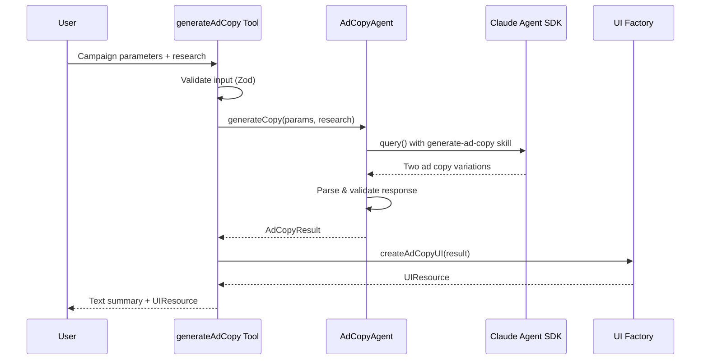

# Design Document: Generate Ad Copy

## Overview

The Generate Ad Copy feature produces two distinct, creative, and copyright-compliant ad copy variations based on campaign parameters and research insights. The system follows the established agent-tool architecture pattern used in the project, integrating with Claude Agent SDK for NLP-based content generation and mcp-ui for interactive result display.

The feature enables advertisers to:
1. Generate two unique ad copy variations with headlines, body copy, and CTAs
2. View variations side-by-side in an interactive UI
3. Select their preferred variation for campaign use
4. Receive a text summary for LLM-assisted discussion

## Architecture

```
┌─────────────────────────────────────────┐
│  MCP Tool (FastMCP)                     │  ← Tool definition, parameter validation
│  src/tools/generate-ad-copy.ts          │
└──────────────┬──────────────────────────┘
               │
┌──────────────▼──────────────────────────┐
│  Agent Service                          │  ← Claude Agent SDK integration
│  src/services/ad-copy-agent.ts          │
└──────────────┬──────────────────────────┘
               │
┌──────────────▼──────────────────────────┐
│  UI Factory                             │  ← UIResource generation
│  src/utils/ad-copy-ui.ts                │
└──────────────┬──────────────────────────┘
               │
┌──────────────▼──────────────────────────┐
│  Schemas (Zod)                          │  ← Type safety & validation
│  src/schemas/ad-copy.ts                 │
└─────────────────────────────────────────┘
```

### Data Flow



## Components and Interfaces

### 1. MCP Tool (`src/tools/generate-ad-copy.ts`)

**Responsibilities:**
- Define tool name, description, and parameters
- Validate input using Zod schema
- Call agent service for copy generation
- Handle errors with categorization
- Return text summary and UIResource

**Interface:**
```typescript
export const generateAdCopyTool = {
  name: 'generateAdCopy',
  description: string,
  parameters: GenerateAdCopyInputSchema,
  execute: (args: GenerateAdCopyInput) => Promise<ToolResponse>
};
```

### 2. Agent Service (`src/services/ad-copy-agent.ts`)

**Responsibilities:**
- Manage Claude Agent SDK lifecycle
- Resolve plugin path for generate-ad-copy skill
- Construct prompts with campaign context
- Parse JSON from agent response
- Validate response against schema

**Interface:**
```typescript
export class AdCopyAgent {
  generateCopy(
    params: CampaignParameters,
    research?: CampaignReport
  ): Promise<AdCopyResult>;
}
```

### 3. UI Factory (`src/utils/ad-copy-ui.ts`)

**Responsibilities:**
- Generate side-by-side comparison UI
- Display headline, body copy, and CTA for each variation
- Provide selection buttons with tool call triggers
- Generate error UIs for different error types

**Interface:**
```typescript
export function createAdCopyUI(result: AdCopyResult): UIResource;
export function createAdCopyErrorUI(
  error: Error,
  errorType: 'validation' | 'agent' | 'timeout' | 'unknown'
): UIResource;
```

### 4. Skill Plugin (`src/plugins/generate-ad-copy/`)

**Structure:**
```
src/plugins/generate-ad-copy/
└── skills/
    └── generate-ad-copy/
        └── SKILL.md
```

**Responsibilities:**
- Define skill instructions for Claude Agent SDK
- Specify output format and requirements
- Provide examples for consistent generation

## Data Models

### AdCopyVariation Schema

```typescript
const AdCopyVariationSchema = z.object({
  variation_id: z.enum(['A', 'B']),
  headline: z.string().min(1, 'Headline must not be empty'),
  body_copy: z.string().min(1, 'Body copy must not be empty'),
  cta: z.string().min(1, 'CTA must not be empty'),
  tone: z.string().nullable(),
  platform_optimized: z.boolean()
});
```

### AdCopyResult Schema

```typescript
const AdCopyResultSchema = z.object({
  generated_at: z.string().datetime(),
  campaign_name: z.string().nullable(),
  platform: z.string().nullable(),
  target_audience: z.string().nullable(),
  variations: z.array(AdCopyVariationSchema).length(2),
  recommended_variation: z.enum(['A', 'B']),
  recommendation_rationale: z.string().min(1),
  disclaimer: z.string().min(1)
});
```

### GenerateAdCopyInput Schema

```typescript
const GenerateAdCopyInputSchema = z.object({
  campaignParameters: CampaignParametersSchema,
  campaignReport: CampaignReportSchema.optional()
});
```

## Correctness Properties

*A property is a characteristic or behavior that should hold true across all valid executions of a system-essentially, a formal statement about what the system should do. Properties serve as the bridge between human-readable specifications and machine-verifiable correctness guarantees.*

### Property 1: Two Distinct Variations

*For any* valid campaign parameters, the Ad Copy Generator SHALL produce exactly two variations, and the two variations SHALL have different content (headline, body_copy, or cta differ).

**Validates: Requirements 1.1, 1.2**

### Property 2: Schema Validation Completeness

*For any* AdCopyResult object, the schema SHALL require:
- Exactly two variations in the variations array
- Each variation has non-empty headline, body_copy, and cta fields
- A recommended_variation field with value 'A' or 'B'
- A non-empty disclaimer field

**Validates: Requirements 7.1, 7.2, 7.3, 2.3**

### Property 3: JSON Round-Trip Consistency

*For any* valid AdCopyResult, serializing to JSON and parsing back SHALL produce an equivalent object that passes schema validation.

**Validates: Requirements 7.4**

### Property 4: UI Structure Completeness

*For any* valid AdCopyResult, the generated UIResource SHALL contain:
- HTML elements displaying both variations
- The headline, body_copy, and cta text from each variation
- Selection buttons for each variation
- JavaScript that triggers tool calls on selection

**Validates: Requirements 4.1, 4.2, 4.3**

### Property 5: Text Summary Completeness

*For any* valid AdCopyResult, the text summary SHALL contain:
- Both variation headlines
- Both variation body copies
- Both variation CTAs
- An indication of the recommended variation

**Validates: Requirements 5.1, 5.2, 5.3**

### Property 6: Validation Error Handling

*For any* invalid input (empty strings, missing required fields), the tool SHALL return an error response with errorType 'validation'.

**Validates: Requirements 6.1**

### Property 7: Error UI Generation

*For any* error type ('validation', 'agent', 'timeout', 'unknown'), the error UI function SHALL produce a valid UIResource with appropriate error messaging.

**Validates: Requirements 6.4**

## Error Handling

### Error Categories

| Error Type | Trigger | User Message | Recovery |
|------------|---------|--------------|----------|
| validation | Invalid input schema | "Invalid input parameters" | Show field errors |
| agent | Claude SDK failure | "Processing error occurred" | Retry button |
| timeout | Request timeout | "Request took too long" | Retry button |
| unknown | Unexpected error | "Unexpected error" | Retry button |

### Error Response Structure

```typescript
interface ErrorResponse {
  content: [
    { type: 'text', text: string },
    UIResource  // Error UI with recovery options
  ]
}
```

## Testing Strategy

### Dual Testing Approach

The feature uses both unit tests and property-based tests for comprehensive coverage:

- **Unit tests**: Verify specific examples, edge cases, and integration points
- **Property tests**: Verify universal properties that should hold across all inputs

### Property-Based Testing

**Library**: fast-check (already configured in project)

**Configuration**: Minimum 100 iterations per property test

**Test File**: `tests/properties/generate-ad-copy.property.test.ts`

**Annotation Format**: Each property test MUST include a comment:
```typescript
// **Feature: generate-ad-copy, Property 1: Two Distinct Variations**
```

### Test Categories

1. **Schema Validation Tests**
   - Valid AdCopyResult passes validation
   - Missing required fields fail validation
   - Invalid variation count fails validation
   - Round-trip JSON serialization preserves data

2. **UI Generation Tests**
   - UIResource contains both variations
   - HTML includes all required elements
   - Selection buttons trigger correct tool calls

3. **Text Summary Tests**
   - Summary includes all variation content
   - Recommendation is indicated

4. **Error Handling Tests**
   - Invalid input returns validation error
   - Error UI generates valid UIResource

### Unit Tests

**Test File**: `tests/unit/generate-ad-copy.test.ts`

**Coverage**:
- Tool execution with valid input
- Tool execution with invalid input
- Agent service response parsing
- UI factory output structure

## UI Design

### Layout

```
┌─────────────────────────────────────────────────────────────┐
│  🎯 Ad Copy Variations                                      │
│  Campaign: [name] • Platform: [platform]                    │
├─────────────────────────────┬───────────────────────────────┤
│  VARIATION A                │  VARIATION B                  │
│  ─────────────              │  ─────────────                │
│  📝 Headline                │  📝 Headline                  │
│  [headline text]            │  [headline text]              │
│                             │                               │
│  📄 Body Copy               │  📄 Body Copy                 │
│  [body copy text]           │  [body copy text]             │
│                             │                               │
│  🎯 Call to Action          │  🎯 Call to Action            │
│  [cta text]                 │  [cta text]                   │
│                             │                               │
│  [Select Variation A]       │  [Select Variation B]         │
│  ⭐ Recommended             │                               │
├─────────────────────────────┴───────────────────────────────┤
│  ⚖️ Copyright Disclaimer                                    │
│  [disclaimer text]                                          │
└─────────────────────────────────────────────────────────────┘
```

### Interaction Flow

1. User views both variations side-by-side
2. Recommended variation is highlighted with a star indicator
3. User clicks "Select Variation A" or "Select Variation B"
4. Button triggers `window.parent.postMessage` with tool call:
   ```javascript
   {
     type: 'tool',
     payload: {
       toolName: 'selectAdCopy',
       params: { selectedVariation: 'A', adCopy: {...} }
     }
   }
   ```

### Design System

Uses project design system variables:
- `--bg-primary`, `--bg-secondary`, `--bg-tertiary` for backgrounds
- `--text-primary`, `--text-secondary`, `--text-tertiary` for text
- `--accent-blue` for primary actions
- `--accent-green` for recommended indicator
- Dark mode support via `prefers-color-scheme: dark`
