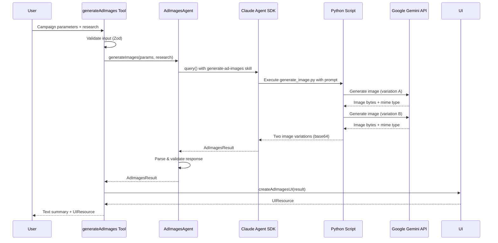
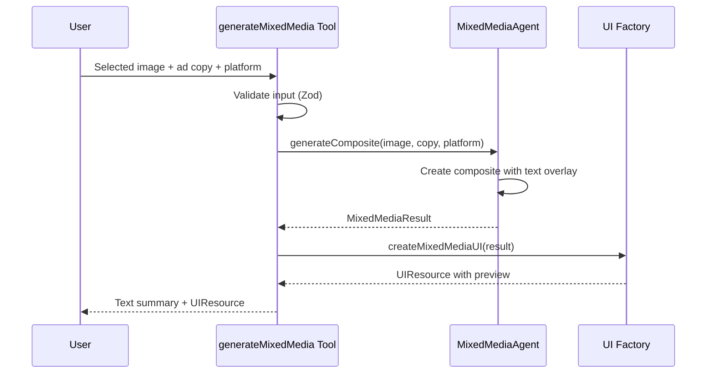

# Design Document: Generate Ad Images & Mixed Media Creatives

## Overview

The Generate Ad Images feature produces two distinct AI-generated image variations for advertising campaigns using Google Gemini's image generation capabilities. The companion Generate Mixed Media Creatives feature combines selected images with ad copy to create complete, platform-ready ad creatives.

The system follows the established agent-tool architecture pattern, with a key difference: image generation is handled by a Python script within the skill plugin that interfaces directly with Google Gemini's API.

Key capabilities:
1. Generate two unique image variations based on campaign parameters
2. View variations side-by-side in an interactive UI
3. Select preferred variation or request regeneration
4. Combine selected image with ad copy for composite creatives
5. Preview and export platform-formatted ad creatives

## Architecture

```
┌─────────────────────────────────────────┐
│  MCP Tools (FastMCP)                    │
│  src/tools/generate-ad-images.ts        │  ← Tool definition, parameter validation
│  src/tools/generate-mixed-media.ts      │
└──────────────┬──────────────────────────┘
               │
┌──────────────▼──────────────────────────┐
│  Agent Services                         │
│  src/services/ad-images-agent.ts        │  ← Claude Agent SDK + Python script
│  src/services/mixed-media-agent.ts      │
└──────────────┬──────────────────────────┘
               │
┌──────────────▼──────────────────────────┐
│  UI Factories                           │
│  src/utils/ad-images-ui.ts              │  ← UIResource generation
│  src/utils/mixed-media-ui.ts            │
└──────────────┬──────────────────────────┘
               │
┌──────────────▼──────────────────────────┐
│  Schemas (Zod)                          │
│  src/schemas/ad-images.ts               │  ← Type safety & validation
│  src/schemas/mixed-media.ts             │
└──────────────┬──────────────────────────┘
               │
┌──────────────▼──────────────────────────┐
│  Skill Plugin with Python Script        │
│  src/plugins/generate-ad-images/        │  ← Gemini API integration
│    └── skills/generate-ad-images/       │
│        ├── SKILL.md                     │
│        └── scripts/generate_image.py    │
└─────────────────────────────────────────┘
```

### Data Flow - Image Generation



### Data Flow - Mixed Media Generation



## Components and Interfaces

### 1. MCP Tools

#### generateAdImages Tool (`src/tools/generate-ad-images.ts`)

**Responsibilities:**
- Define tool name, description, and parameters
- Validate input using Zod schema
- Call agent service for image generation
- Handle errors with categorization
- Return text summary and UIResource

**Interface:**
```typescript
export const generateAdImagesTool = {
  name: 'generateAdImages',
  description: string,
  parameters: GenerateAdImagesInputSchema,
  execute: (args: GenerateAdImagesInput) => Promise<ToolResponse>
};
```

#### generateMixedMediaCreative Tool (`src/tools/generate-mixed-media.ts`)

**Responsibilities:**
- Accept selected image and ad copy
- Generate composite with text overlay
- Apply platform-specific formatting
- Return preview UIResource with export options

**Interface:**
```typescript
export const generateMixedMediaCreativeTool = {
  name: 'generateMixedMediaCreative',
  description: string,
  parameters: GenerateMixedMediaInputSchema,
  execute: (args: GenerateMixedMediaInput) => Promise<ToolResponse>
};
```

### 2. Agent Services

#### AdImagesAgent (`src/services/ad-images-agent.ts`)

**Responsibilities:**
- Manage Claude Agent SDK lifecycle
- Resolve plugin path for generate-ad-images skill
- Build image generation prompts from campaign context
- Execute Python script for Gemini API calls
- Parse and validate response against schema

**Interface:**
```typescript
export class AdImagesAgent {
  generateImages(
    params: CampaignParameters,
    research?: CampaignReport
  ): Promise<AdImagesResult>;
}
```

#### MixedMediaAgent (`src/services/mixed-media-agent.ts`)

**Responsibilities:**
- Combine image with ad copy text
- Apply platform-specific layouts and dimensions
- Generate composite image data

**Interface:**
```typescript
export class MixedMediaAgent {
  generateComposite(
    image: ImageVariation,
    adCopy: AdCopyVariation,
    platform: string
  ): Promise<MixedMediaResult>;
}
```

### 3. UI Factories

#### Ad Images UI (`src/utils/ad-images-ui.ts`)

**Responsibilities:**
- Generate side-by-side image comparison UI
- Display images with variation labels
- Provide selection buttons with tool call triggers
- Provide regenerate button
- Generate error UIs for different error types

**Interface:**
```typescript
export function createAdImagesUI(result: AdImagesResult): UIResource;
export function createAdImagesErrorUI(
  error: Error,
  errorType: 'validation' | 'api' | 'timeout' | 'unknown'
): UIResource;
```

#### Mixed Media UI (`src/utils/mixed-media-ui.ts`)

**Responsibilities:**
- Display composite preview
- Provide download/export buttons
- Provide regeneration options
- Format preview to platform dimensions

**Interface:**
```typescript
export function createMixedMediaUI(result: MixedMediaResult): UIResource;
export function createMixedMediaErrorUI(
  error: Error,
  errorType: 'validation' | 'generation' | 'unknown'
): UIResource;
```

### 4. Skill Plugin (`src/plugins/generate-ad-images/`)

**Structure:**
```
src/plugins/generate-ad-images/
└── skills/
    └── generate-ad-images/
        ├── SKILL.md
        └── scripts/
            └── generate_image.py
```

**Python Script Interface:**
```python
# generate_image.py
# Input: prompt (string) via stdin or argument
# Output: JSON with image_data (base64), mime_type
# Uses: google.genai.Client for Gemini API

from google import genai
import base64
import json
import sys

def generate_image(prompt: str) -> dict:
    client = genai.Client(vertexai=False)
    response = client.models.generate_content(
        model="gemini-2.0-flash-exp",
        contents=[prompt]
    )
    
    for part in response.candidates[0].content.parts:
        if part.inline_data is not None:
            data = part.inline_data.data
            mime = part.inline_data.mime_type
            return {
                "image_data": base64.b64encode(data).decode('utf-8'),
                "mime_type": mime
            }
    
    raise Exception("No image generated")
```

## Data Models

### ImageVariation Schema

```typescript
const ImageVariationSchema = z.object({
  variation_id: z.enum(['A', 'B']),
  image_data: z.string().min(1, 'Image data must not be empty'),  // base64
  mime_type: z.string().regex(/^image\/(png|jpeg|webp)$/, 'Invalid mime type'),
  prompt_used: z.string().min(1, 'Prompt must not be empty'),
  visual_approach: z.string().min(1, 'Visual approach description required'),
  dimensions: z.object({
    width: z.number().positive(),
    height: z.number().positive()
  })
});
```

### AdImagesResult Schema

```typescript
const AdImagesResultSchema = z.object({
  generated_at: z.string().datetime(),
  campaign_name: z.string().nullable(),
  platform: z.string().nullable(),
  target_audience: z.string().nullable(),
  variations: z.array(ImageVariationSchema).length(2),
  recommended_variation: z.enum(['A', 'B']),
  recommendation_rationale: z.string().min(1)
});
```

### GenerateAdImagesInput Schema

```typescript
const GenerateAdImagesInputSchema = z.object({
  campaignParameters: CampaignParametersSchema,
  campaignReport: CampaignReportSchema.optional()
});
```

### MixedMediaResult Schema

```typescript
const MixedMediaResultSchema = z.object({
  generated_at: z.string().datetime(),
  composite_image_data: z.string().min(1),  // base64
  mime_type: z.string(),
  platform: z.string(),
  dimensions: z.object({
    width: z.number().positive(),
    height: z.number().positive()
  }),
  source_image_variation: z.enum(['A', 'B']),
  ad_copy_used: z.object({
    headline: z.string(),
    body_copy: z.string(),
    cta: z.string()
  })
});
```

### GenerateMixedMediaInput Schema

```typescript
const GenerateMixedMediaInputSchema = z.object({
  selectedImage: ImageVariationSchema,
  adCopy: AdCopyVariationSchema,
  platform: z.string().min(1)
});
```

### Platform Dimensions

```typescript
const PLATFORM_DIMENSIONS = {
  tiktok: { width: 1080, height: 1920 },      // 9:16 vertical
  instagram_feed: { width: 1080, height: 1080 }, // 1:1 square
  instagram_story: { width: 1080, height: 1920 }, // 9:16 vertical
  facebook_feed: { width: 1200, height: 628 },   // 1.91:1 landscape
  facebook_story: { width: 1080, height: 1920 }, // 9:16 vertical
  linkedin: { width: 1200, height: 627 }         // 1.91:1 landscape
};
```

## Correctness Properties

*A property is a characteristic or behavior that should hold true across all valid executions of a system-essentially, a formal statement about what the system should do. Properties serve as the bridge between human-readable specifications and machine-verifiable correctness guarantees.*

### Property 1: Two Distinct Variations

*For any* valid campaign parameters, the Ad Image Generator SHALL produce exactly two variations, and the two variations SHALL have different image data (base64 strings differ).

**Validates: Requirements 1.1, 1.2**

### Property 2: Schema Validation Completeness

*For any* AdImagesResult object, the schema SHALL require:
- Exactly two variations in the variations array
- Each variation has non-empty image_data, mime_type, and variation_id fields
- A recommended_variation field with value 'A' or 'B'
- Valid dimensions with positive width and height

**Validates: Requirements 6.1, 6.2, 6.3**

### Property 3: JSON Round-Trip Consistency

*For any* valid AdImagesResult, serializing to JSON and parsing back SHALL produce an equivalent object that passes schema validation.

**Validates: Requirements 6.4**

### Property 4: Image UI Structure Completeness

*For any* valid AdImagesResult, the generated UIResource SHALL contain:
- HTML elements displaying both image variations
- Labels for Variation A and Variation B
- Selection buttons for each variation
- A regenerate button
- JavaScript that triggers tool calls on selection

**Validates: Requirements 3.1, 3.2, 3.3, 3.4, 3.5**

### Property 5: Text Summary Completeness

*For any* valid AdImagesResult, the text summary SHALL contain:
- Descriptions of both variation visual approaches
- An indication of the recommended variation
- The recommendation rationale

**Validates: Requirements 4.1, 4.2, 4.3**

### Property 6: Validation Error Handling

*For any* invalid input (empty strings, missing required fields), the tool SHALL return an error response with errorType 'validation'.

**Validates: Requirements 5.1**

### Property 7: Error UI Generation

*For any* error type ('validation', 'api', 'timeout', 'unknown'), the error UI function SHALL produce a valid UIResource with appropriate error messaging and recovery options.

**Validates: Requirements 5.4**

### Property 8: Mixed Media Composite Generation

*For any* valid selected image and ad copy, the Mixed Media Generator SHALL produce a composite that includes:
- The source image data
- The headline, body copy, and CTA text
- Platform-appropriate dimensions

**Validates: Requirements 7.1, 7.2, 7.3**

### Property 9: Mixed Media UI Completeness

*For any* valid MixedMediaResult, the generated UIResource SHALL contain:
- The composite image preview
- Download/export buttons
- Regeneration options
- Platform-formatted dimensions

**Validates: Requirements 7.4, 8.1, 8.2, 8.3**

### Property 10: Platform-Specific Dimensions

*For any* specified platform, the generated images and composites SHALL have dimensions matching the platform's specifications (e.g., TikTok: 1080x1920, Instagram Feed: 1080x1080).

**Validates: Requirements 2.1, 8.4**

## Error Handling

### Error Categories

| Error Type | Trigger | User Message | Recovery |
|------------|---------|--------------|----------|
| validation | Invalid input schema | "Invalid input parameters" | Show field errors |
| api | Gemini API failure | "Image generation failed" | Retry button |
| timeout | Request timeout | "Request took too long" | Retry button |
| unknown | Unexpected error | "Unexpected error" | Retry button |

### Error Response Structure

```typescript
interface ErrorResponse {
  content: [
    { type: 'text', text: string },
    UIResource  // Error UI with recovery options
  ]
}
```

## Testing Strategy

### Dual Testing Approach

The feature uses both unit tests and property-based tests for comprehensive coverage:

- **Unit tests**: Verify specific examples, edge cases, and integration points
- **Property tests**: Verify universal properties that should hold across all inputs

### Property-Based Testing

**Library**: fast-check (already configured in project)

**Configuration**: Minimum 100 iterations per property test

**Test Files**: 
- `tests/properties/generate-ad-images.property.test.ts`
- `tests/properties/generate-mixed-media.property.test.ts`

**Annotation Format**: Each property test MUST include a comment:
```typescript
// **Feature: generate-ad-images, Property 1: Two Distinct Variations**
```

### Test Categories

1. **Schema Validation Tests**
   - Valid AdImagesResult passes validation
   - Missing required fields fail validation
   - Invalid variation count fails validation
   - Round-trip JSON serialization preserves data

2. **UI Generation Tests**
   - UIResource contains both image variations
   - HTML includes all required elements (labels, buttons)
   - Selection buttons trigger correct tool calls

3. **Text Summary Tests**
   - Summary includes visual approach descriptions
   - Recommendation is indicated

4. **Error Handling Tests**
   - Invalid input returns validation error
   - Error UI generates valid UIResource for all error types

5. **Mixed Media Tests**
   - Composite includes all ad copy elements
   - Platform dimensions are applied correctly

### Unit Tests

**Test Files**: 
- `tests/unit/generate-ad-images.test.ts`
- `tests/unit/generate-mixed-media.test.ts`

**Coverage**:
- Tool execution with valid input
- Tool execution with invalid input
- Agent service response parsing
- UI factory output structure
- Python script integration (mocked)

## UI Design

### Image Selection UI

```
┌─────────────────────────────────────────────────────────────┐
│  🖼️ Ad Image Variations                                     │
│  Campaign: [name] • Platform: [platform]                    │
├─────────────────────────────┬───────────────────────────────┤
│  VARIATION A                │  VARIATION B                  │
│  ─────────────              │  ─────────────                │
│  ┌─────────────────────┐    │  ┌─────────────────────┐      │
│  │                     │    │  │                     │      │
│  │    [Image A]        │    │  │    [Image B]        │      │
│  │                     │    │  │                     │      │
│  └─────────────────────┘    │  └─────────────────────┘      │
│                             │                               │
│  Visual Approach:           │  Visual Approach:             │
│  [description]              │  [description]                │
│                             │                               │
│  [Select Variation A]       │  [Select Variation B]         │
│  ⭐ Recommended             │                               │
├─────────────────────────────┴───────────────────────────────┤
│  [🔄 Regenerate Both Variations]                            │
└─────────────────────────────────────────────────────────────┘
```

### Mixed Media Preview UI

```
┌─────────────────────────────────────────────────────────────┐
│  🎨 Mixed Media Creative Preview                            │
│  Platform: [platform] • Format: [dimensions]                │
├─────────────────────────────────────────────────────────────┤
│  ┌─────────────────────────────────────────────────────┐    │
│  │                                                     │    │
│  │              [Composite Image Preview]              │    │
│  │                                                     │    │
│  │    ┌─────────────────────────────────────────┐     │    │
│  │    │  [Headline]                             │     │    │
│  │    │  [Body Copy]                            │     │    │
│  │    │  [CTA Button]                           │     │    │
│  │    └─────────────────────────────────────────┘     │    │
│  │                                                     │    │
│  └─────────────────────────────────────────────────────┘    │
├─────────────────────────────────────────────────────────────┤
│  [📥 Download PNG]  [📥 Download JPEG]                      │
│  [🔄 Try Different Copy]  [🖼️ Try Different Image]          │
└─────────────────────────────────────────────────────────────┘
```

### Interaction Flow

1. User views both image variations side-by-side
2. Recommended variation is highlighted with a star indicator
3. User clicks "Select Variation A" or "Select Variation B"
4. Button triggers `window.parent.postMessage` with tool call:
   ```javascript
   {
     type: 'tool',
     payload: {
       toolName: 'generateMixedMediaCreative',
       params: { 
         selectedImage: {...}, 
         adCopy: {...},
         platform: 'tiktok'
       }
     }
   }
   ```
5. Mixed media preview is displayed
6. User can download or regenerate

### Design System

Uses project design system variables:
- `--bg-primary`, `--bg-secondary`, `--bg-tertiary` for backgrounds
- `--text-primary`, `--text-secondary`, `--text-tertiary` for text
- `--accent-blue` for primary actions
- `--accent-green` for recommended indicator
- Dark mode support via `prefers-color-scheme: dark`

