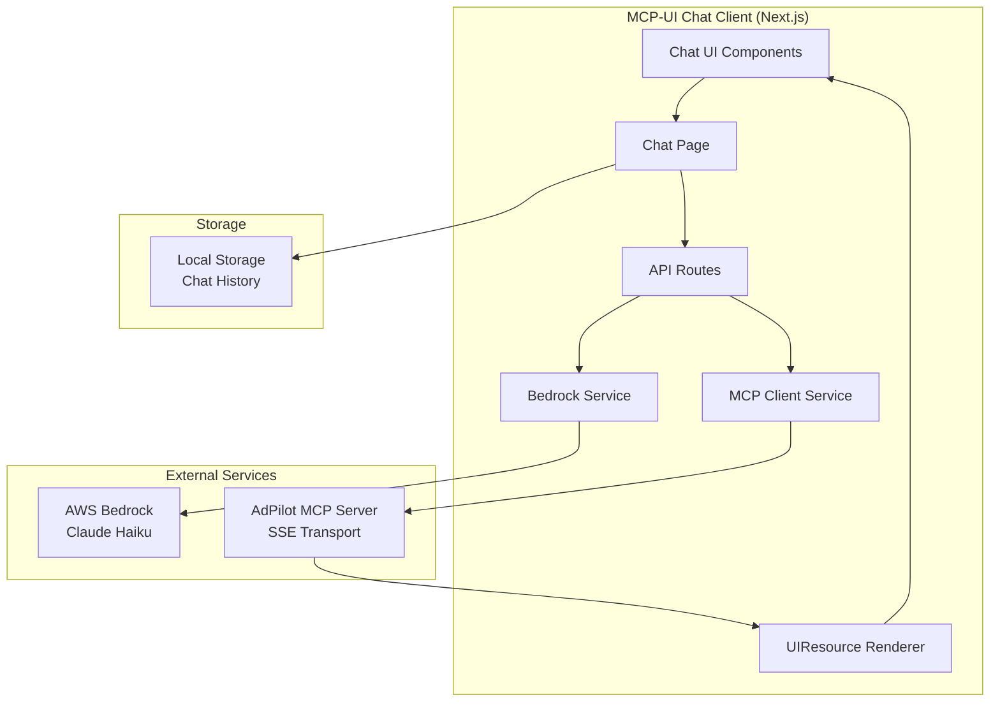

# Design Document: MCP-UI Chat Client

## Overview

The MCP-UI Chat Client is a Next.js web application that provides a chat interface for interacting with AI (Claude Haiku via AWS Bedrock) while supporting MCP tool calls and rendering interactive UIResources. The client connects to the AdPilot MCP server via HTTP streaming transport and can display rich UI components returned by MCP tools.

The key differentiator from standard chat clients is the integration with `@mcp-ui/client` to render UIResources - interactive HTML, external URLs, and Remote DOM components - directly within the chat interface.

## Architecture



### Component Architecture

```mermaid
graph TB
    subgraph "Pages"
        ChatPage["/chat - Main Chat Page"]
    end
    
    subgraph "Components"
        ChatContainer[ChatContainer]
        MessageList[MessageList]
        MessageItem[MessageItem]
        TextMessage[TextMessage]
        ToolCallMessage[ToolCallMessage]
        UIResourceMessage[UIResourceMessage]
        ChatInput[ChatInput]
        ConnectionStatus[ConnectionStatus]
        ChatHistory[ChatHistory]
    end
    
    subgraph "MCP-UI"
        UIResourceRenderer[UIResourceRenderer<br/>@mcp-ui/client]
    end
    
    ChatPage --> ChatContainer
    ChatContainer --> MessageList
    ChatContainer --> ChatInput
    ChatContainer --> ConnectionStatus
    ChatContainer --> ChatHistory
    MessageList --> MessageItem
    MessageItem --> TextMessage
    MessageItem --> ToolCallMessage
    MessageItem --> UIResourceMessage
    UIResourceMessage --> UIResourceRenderer
```

## Components and Interfaces

### Core Services

#### BedrockService
Handles communication with AWS Bedrock using the ConverseStream API.

```typescript
interface BedrockService {
  // Send a message and get streaming response
  converseStream(params: ConverseParams): AsyncGenerator<StreamEvent>;
  
  // Check if credentials are configured
  isConfigured(): boolean;
}

interface ConverseParams {
  messages: ConversationMessage[];
  tools?: ToolDefinition[];
  systemPrompt?: string;
}

interface StreamEvent {
  type: 'text' | 'tool_use' | 'stop';
  content?: string;
  toolUse?: {
    toolUseId: string;
    name: string;
    input: Record<string, unknown>;
  };
}
```

#### MCPClientService
Manages connection to the MCP server and tool execution using HTTP streaming transport.

```typescript
interface MCPClientService {
  // Connect to MCP server via HTTP streaming transport
  connect(url: string): Promise<void>;
  
  // Disconnect from server
  disconnect(): void;
  
  // Get available tools
  getTools(): ToolDefinition[];
  
  // Execute a tool
  callTool(name: string, params: Record<string, unknown>): Promise<ToolResult>;
  
  // Connection status
  isConnected(): boolean;
  getConnectionError(): string | null;
}

interface ToolDefinition {
  name: string;
  description: string;
  inputSchema: JSONSchema;
}

interface ToolResult {
  content: ToolResultContent[];
  isError?: boolean;
}

type ToolResultContent = 
  | { type: 'text'; text: string }
  | { type: 'resource'; resource: UIResource };
```

### UI Components

#### ChatContainer
Main container component that orchestrates the chat experience.

```typescript
interface ChatContainerProps {
  initialMessages?: ChatMessage[];
  onMessagesChange?: (messages: ChatMessage[]) => void;
}
```

#### MessageItem
Renders individual messages based on their type.

```typescript
interface MessageItemProps {
  message: ChatMessage;
  onUIAction: (action: UIAction) => Promise<UIActionResult>;
}
```

#### UIResourceMessage
Renders UIResources using the mcp-ui client library.

```typescript
interface UIResourceMessageProps {
  resource: UIResource;
  onUIAction: (action: UIAction) => Promise<UIActionResult>;
}
```

### Data Types

```typescript
interface ChatMessage {
  id: string;
  role: 'user' | 'assistant' | 'tool';
  content: MessageContent[];
  timestamp: number;
}

type MessageContent =
  | { type: 'text'; text: string }
  | { type: 'tool_use'; toolUseId: string; name: string; input: Record<string, unknown> }
  | { type: 'tool_result'; toolUseId: string; content: ToolResultContent[] }
  | { type: 'resource'; resource: UIResource };

interface UIResource {
  uri: string;
  mimeType: string;
  text?: string;
  blob?: string;
  _meta?: Record<string, unknown>;
}

interface UIAction {
  type: 'tool' | 'prompt' | 'notify' | 'link' | 'intent';
  payload: Record<string, unknown>;
  messageId?: string;
}

interface UIActionResult {
  status: string;
  result?: unknown;
  error?: string;
}

interface ChatSession {
  id: string;
  title: string;
  messages: ChatMessage[];
  createdAt: number;
  updatedAt: number;
}
```

## Data Models

### Environment Configuration

```typescript
interface EnvironmentConfig {
  // AWS Bedrock
  AWS_ACCESS_KEY_ID: string;
  AWS_SECRET_ACCESS_KEY: string;
  AWS_REGION: string;
  BEDROCK_MODEL_ID: string; // default: us.anthropic.claude-haiku-4-5-20251001-v1:0
  
  // MCP Server
  MCP_SERVER_URL: string;
}
```

### Message Serialization Schema

```typescript
const ChatMessageSchema = z.object({
  id: z.string(),
  role: z.enum(['user', 'assistant', 'tool']),
  content: z.array(z.union([
    z.object({ type: z.literal('text'), text: z.string() }),
    z.object({
      type: z.literal('tool_use'),
      toolUseId: z.string(),
      name: z.string(),
      input: z.record(z.unknown())
    }),
    z.object({
      type: z.literal('tool_result'),
      toolUseId: z.string(),
      content: z.array(z.union([
        z.object({ type: z.literal('text'), text: z.string() }),
        z.object({ type: z.literal('resource'), resource: UIResourceSchema })
      ]))
    }),
    z.object({ type: z.literal('resource'), resource: UIResourceSchema })
  ])),
  timestamp: z.number()
});

const UIResourceSchema = z.object({
  uri: z.string(),
  mimeType: z.string(),
  text: z.string().optional(),
  blob: z.string().optional(),
  _meta: z.record(z.unknown()).optional()
});

const ChatSessionSchema = z.object({
  id: z.string(),
  title: z.string(),
  messages: z.array(ChatMessageSchema),
  createdAt: z.number(),
  updatedAt: z.number()
});
```

## Correctness Properties

*A property is a characteristic or behavior that should hold true across all valid executions of a system-essentially, a formal statement about what the system should do. Properties serve as the bridge between human-readable specifications and machine-verifiable correctness guarantees.*

Based on the prework analysis, the following correctness properties have been identified:

### Property 1: Message submission invokes Bedrock with correct model
*For any* valid user message string, submitting it SHALL result in a Bedrock API call with the model ID `us.anthropic.claude-haiku-4-5-20251001-v1:0` and the message SHALL be added to the conversation.
**Validates: Requirements 1.1, 4.2**

### Property 2: UIResource detection and rendering
*For any* tool response containing a resource with `ui://` URI scheme, the Chat_Client SHALL render it using the UIResourceRenderer component rather than as plain text.
**Validates: Requirements 2.1**

### Property 3: UIResource action handling by type
*For any* UIAction received from a rendered UIResource, the Chat_Client SHALL invoke the appropriate handler based on action type: 'tool' triggers MCP tool call, 'notify' displays notification, 'link' opens URL.
**Validates: Requirements 2.5, 5.1, 5.3**

### Property 4: Async message response
*For any* UIAction that includes a messageId, the Chat_Client SHALL send a response message back to the iframe containing the action result or error.
**Validates: Requirements 5.5**

### Property 5: Tool discovery after connection
*For any* successful MCP server connection, the Chat_Client SHALL have access to all tools exposed by the server and make them available to the AI.
**Validates: Requirements 3.3**

### Property 6: Message serialization round-trip
*For any* valid ChatMessage object, serializing to JSON and deserializing back SHALL produce an equivalent object with all content preserved including UIResources.
**Validates: Requirements 9.1, 9.2, 9.3**

### Property 7: Schema validation on deserialization
*For any* JSON string that does not conform to the ChatMessageSchema, deserialization SHALL reject it with a validation error.
**Validates: Requirements 9.4**

### Property 8: Tool error display and conversation continuity
*For any* tool call that fails, the Chat_Client SHALL display the error message and allow the conversation to continue without blocking.
**Validates: Requirements 8.2**

### Property 9: AI error display
*For any* Bedrock API error response, the Chat_Client SHALL display a user-friendly error message rather than raw error details.
**Validates: Requirements 8.3**

### Property 10: UIResource render fallback
*For any* UIResource that fails to render (invalid content, network error, etc.), the Chat_Client SHALL display a fallback error state instead of crashing.
**Validates: Requirements 8.4**

### Property 11: Message persistence
*For any* message exchange in a conversation, the Chat_Client SHALL persist the message to storage before the next user interaction.
**Validates: Requirements 6.2**

### Property 12: Conversation loading
*For any* previously saved conversation, selecting it SHALL load and display all messages with their original content and UIResources.
**Validates: Requirements 6.4**

### Property 13: Iframe sizing from metadata
*For any* UIResource with preferredFrameSize metadata, the rendered iframe SHALL use those dimensions.
**Validates: Requirements 7.4**

## Error Handling

### Connection Errors
- MCP server unreachable: Display error banner with retry button
- HTTP streaming connection dropped: Attempt automatic reconnection with exponential backoff
- Invalid MCP_SERVER_URL: Display configuration error on startup

### API Errors
- AWS credentials missing: Display setup instructions
- Bedrock rate limit: Display "Please wait" message with countdown
- Bedrock service error: Display generic error with retry option

### Rendering Errors
- Invalid UIResource: Display fallback error card
- Iframe load failure: Display error with resource URI
- Remote DOM script error: Catch and display error boundary

### Validation Errors
- Invalid message format: Log error, skip invalid message
- Schema validation failure: Display error, don't persist invalid data

## Testing Strategy

### Unit Testing (Vitest)
- Test individual components in isolation
- Test service methods with mocked dependencies
- Test utility functions (serialization, validation)

### Property-Based Testing (fast-check)
- Test message serialization round-trip with arbitrary messages
- Test UIResource detection with arbitrary tool responses
- Test action handler routing with arbitrary actions
- Test schema validation with arbitrary JSON

### Integration Testing
- Test Bedrock service with mocked AWS SDK
- Test MCP client with mocked SSE server
- Test full chat flow with mocked services

### Testing Framework Configuration
- Framework: Vitest
- Property testing: fast-check
- Minimum iterations: 100 per property test
- Coverage target: 80%

### Test File Organization
```
mcp-ui-chat-client/
├── __tests__/
│   ├── unit/
│   │   ├── components/
│   │   ├── services/
│   │   └── utils/
│   ├── properties/
│   │   ├── message-serialization.property.test.ts
│   │   ├── ui-resource-detection.property.test.ts
│   │   ├── action-handling.property.test.ts
│   │   └── schema-validation.property.test.ts
│   └── integration/
│       ├── bedrock-service.test.ts
│       └── mcp-client.test.ts
```
