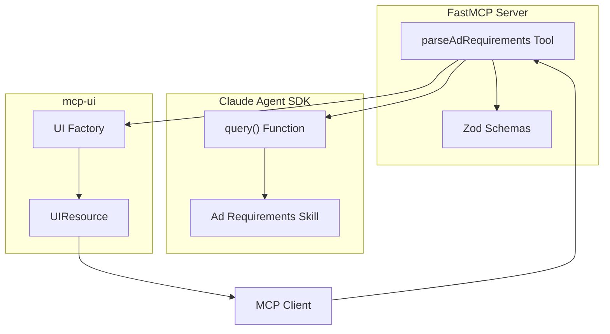

# Design Document: Parse Advertising Requirements MCP Tool

## Overview

This document describes the design for a Parse Advertising Requirements MCP tool that enables advertisers to input natural language campaign descriptions and receive structured, validated campaign parameters. The tool integrates with the Claude Agent SDK to invoke a specialized sub-agent for parameter extraction and uses mcp-ui for interactive result display.

The system follows a three-layer architecture:
1. **MCP Tool Layer**: FastMCP tool definition with Zod validation
2. **Agent Layer**: Claude Agent SDK integration with custom Skill
3. **UI Layer**: mcp-ui UIResource generation for interactive display

## Architecture



## Components and Interfaces

### 1. Parse Ad Requirements Tool (`src/tools/parse-ad-requirements.ts`)

The main FastMCP tool that orchestrates the parsing workflow.

```typescript
interface ParseAdRequirementsInput {
  requestText: string;  // Natural language campaign description
}

interface ParseAdRequirementsOutput {
  content: UIResource[];
}
```

### 2. Campaign Parameters Schema (`src/schemas/campaign-params.ts`)

Zod schemas for validating campaign parameters.

```typescript
interface CampaignParameters {
  product_or_service: string | null;
  product_or_service_url: string | null;
  campaign_name: string | null;
  target_audience: string | null;
  geography: string | null;
  ad_format: string | null;
  budget: string | null;
  platform: string | null;
  kpi: string | null;
  time_period: string | null;
  creative_direction: string | null;
  other_details: string | null;
}

interface ValidationResult {
  success: boolean;
  parameters: CampaignParameters;
  missingFields: string[];
  suggestions?: Record<string, string>;
}
```

### 3. Agent Service (`src/services/ad-requirements-agent.ts`)

Service that wraps Claude Agent SDK calls.

```typescript
interface AgentService {
  parseRequirements(requestText: string): Promise<ValidationResult>;
}
```

### 4. UI Factory (`src/utils/ad-requirements-ui.ts`)

Functions for generating UIResources.

```typescript
interface UIFactory {
  createParametersUI(result: ValidationResult): UIResource;
  createErrorUI(error: Error): UIResource;
  createMissingFieldPromptUI(field: string, examples: string[]): UIResource;
}
```

### 5. Agent Skill (`skills/parse-ad-requirements.md`)

Markdown file containing instructions for the sub-agent.

## Data Models

### CampaignParameters Schema

```typescript
import { z } from 'zod';

export const CampaignParametersSchema = z.object({
  product_or_service: z.string().nullable(),
  product_or_service_url: z.string().url().nullable().or(z.literal(null)),
  campaign_name: z.string().nullable(),
  target_audience: z.string().nullable(),
  geography: z.string().nullable(),
  ad_format: z.string().nullable(),
  budget: z.string().nullable(),
  platform: z.string().nullable(),
  kpi: z.string().nullable(),
  time_period: z.string().nullable(),
  creative_direction: z.string().nullable(),
  other_details: z.string().nullable()
});

export const ValidationResultSchema = z.object({
  success: z.boolean(),
  parameters: CampaignParametersSchema,
  missingFields: z.array(z.string()),
  suggestions: z.record(z.string()).optional()
});
```

### Input Schema

```typescript
export const ParseAdRequirementsInputSchema = z.object({
  requestText: z.string()
    .min(1, 'Request text must not be empty')
    .refine(
      (val) => val.trim().length > 0,
      { message: 'Request text must contain non-whitespace characters' }
    )
});
```

## Correctness Properties

*A property is a characteristic or behavior that should hold true across all valid executions of a system-essentially, a formal statement about what the system should do. Properties serve as the bridge between human-readable specifications and machine-verifiable correctness guarantees.*

Based on the prework analysis, the following correctness properties have been identified:

### Property 1: Valid input acceptance
*For any* non-empty string containing at least one non-whitespace character, the Parse_Ad_Requirements_Tool SHALL accept the input and return a ValidationResult (not an error).
**Validates: Requirements 1.1, 1.3**

### Property 2: Whitespace-only input rejection
*For any* string composed entirely of whitespace characters (including empty string), the Parse_Ad_Requirements_Tool SHALL reject the input with a validation error.
**Validates: Requirements 1.2**

### Property 3: ValidationResult structure completeness
*For any* successful parse operation, the returned ValidationResult SHALL contain a parameters object with all 12 Campaign_Parameter fields and a missingFields array.
**Validates: Requirements 2.1, 2.4**

### Property 4: Success flag consistency
*For any* ValidationResult, the success flag SHALL be true if and only if the missingFields array is empty.
**Validates: Requirements 3.4**

### Property 5: UIResource generation for parameters
*For any* valid CampaignParameters object, the UI factory SHALL produce a UIResource with type 'rawHtml' and a non-empty htmlString.
**Validates: Requirements 4.1**

### Property 6: UIResource styling consistency
*For any* generated UIResource, the htmlString SHALL contain a style tag with CSS variables matching the project design system (--bg-primary, --bg-secondary, --text-primary, etc.).
**Validates: Requirements 4.2**

### Property 7: UIResource structure for parameters
*For any* generated parameters UIResource, the htmlString SHALL contain div elements with class names for card-based layout (param-card, param-label, param-value).
**Validates: Requirements 4.3**

### Property 8: Missing field visual distinction
*For any* ValidationResult with non-empty missingFields, the generated UIResource SHALL contain elements with a distinct CSS class (missing-field) for each missing field.
**Validates: Requirements 4.4**

### Property 9: Confirmation button presence
*For any* ValidationResult where success is true, the generated UIResource SHALL contain a button element with an onclick handler that posts a message with type 'tool'.
**Validates: Requirements 4.5**

### Property 10: Schema validation round-trip
*For any* valid CampaignParameters object, serializing to JSON and parsing back through the schema SHALL produce an equivalent object.
**Validates: Requirements 6.4**

### Property 11: Input schema enforcement
*For any* input that fails the ParseAdRequirementsInputSchema validation, the tool SHALL throw a ZodError with path information.
**Validates: Requirements 6.1, 6.3**

### Property 12: Output schema enforcement
*For any* ValidationResult returned by the agent, parsing through ValidationResultSchema SHALL succeed without throwing.
**Validates: Requirements 6.2**

## Error Handling

### Error Types

1. **ValidationError**: Input fails Zod schema validation
   - Return descriptive error message with field path
   - Generate error UIResource with retry suggestion

2. **AgentError**: Claude Agent SDK call fails
   - Log error details to console
   - Return user-friendly error UIResource
   - Include retry button in UI

3. **TimeoutError**: Agent call exceeds timeout threshold
   - Return timeout-specific error UIResource
   - Suggest retrying with simpler input

4. **UnexpectedError**: Any other error
   - Log full error stack trace
   - Return generic error UIResource
   - Do not expose internal details to user

### Error UIResource Template

```typescript
function createErrorUI(error: Error, errorType: string): UIResource {
  // Generate HTML with:
  // - Error icon and title
  // - User-friendly message based on errorType
  // - Retry button (if applicable)
  // - Consistent styling with design system
}
```

## Testing Strategy

### Unit Testing

Unit tests will cover:
- Zod schema validation for valid and invalid inputs
- UI factory functions with various CampaignParameters states
- Error handling paths with mocked errors
- Individual helper functions

### Property-Based Testing

Property-based tests using fast-check will verify:
- All correctness properties defined above
- Schema round-trip consistency
- Input validation across generated strings
- UIResource structure invariants

**Testing Framework**: Vitest with fast-check for property-based testing

**Property Test Configuration**:
- Minimum 100 iterations per property
- Each test tagged with format: `**Feature: parse-ad-requirements, Property {number}: {property_text}**`

### Test File Structure

```
tests/
├── unit/
│   └── parse-ad-requirements.test.ts
└── properties/
    └── parse-ad-requirements.property.test.ts
```

### Integration Testing (Manual)

- Test with MCP Inspector: `npm run mcp:inspect`
- Verify end-to-end flow with real Claude Agent SDK calls
- Test UI rendering in MCP client
