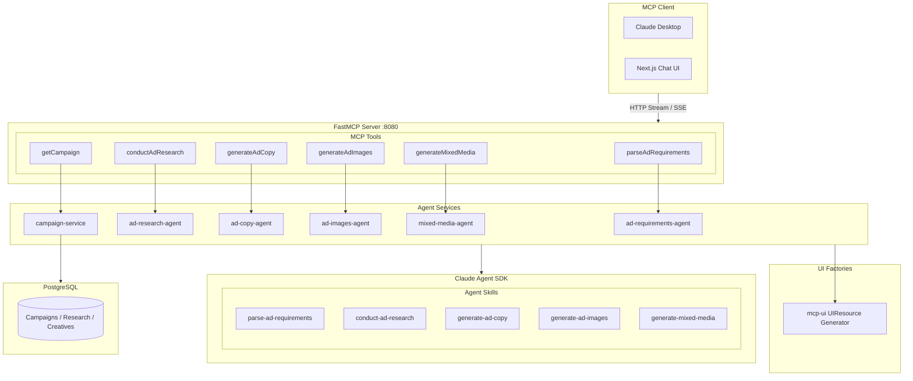

# FeedMob AdPilot MCP Server

AI-powered advertising campaign planning and creative generation system built as a Model Context Protocol (MCP) server. Leverages Claude Agent SDK with specialized skills and MCP tools for intelligent processing, plus mcp-ui for rich, interactive UI components.

## Live Demo

| Service | URL |
|---------|-----|
| MCP Server | https://b8ggscok0gkgw848444gcokw.coolify-dev-pa.tonob.net/mcp |
| Client UI | https://sc80sggw884kw448kc0sckw0.coolify-dev-pa.tonob.net/ |

Try the Client UI to interact with the MCP server and explore the full campaign creation workflow.

## Overview

AdPilot transforms natural language campaign briefs into structured advertising assets through a multi-stage workflow. Advertisers describe their campaign goals in plain English, and the system extracts parameters, conducts market research, generates ad copy variations, creates image concepts, and combines them into complete mixed-media creatives—all with persistent campaign storage.

## Architecture



## Workflow

```mermaid
flowchart LR
    A[Natural Language Input] --> B[parseAdRequirements]
    B --> C[Structured Campaign Parameters]
    C --> D[conductAdResearch]
    D --> E[Research Report]
    E --> F[generateAdCopy]
    F --> G[Ad Copy Variations]
    G --> H[generateAdImages]
    H --> I[Image Variations]
    I --> J[generateMixedMedia]
    J --> K[Final Creative Assets]
    K --> L[(PostgreSQL)]
```



## Key Features

| Feature | Description |
|---------|-------------|
| **Natural Language Parsing** | Extracts structured campaign parameters (budget, platform, audience, objectives) from free-form input |
| **Market Research** | Generates comprehensive reports with audience insights, competitor analysis, and platform strategies |
| **Ad Copy Generation** | Creates multiple copy variations optimized for target platforms (TikTok, Facebook, Instagram) |
| **Image Generation** | Produces image concepts with interactive selection UI |
| **Mixed Media Assembly** | Combines selected images with ad copy into complete creative assets |
| **Campaign Persistence** | Stores and retrieves campaign data via PostgreSQL |

## Technology Stack

| Category | Technology |
|----------|------------|
| Runtime | Node.js 20+, TypeScript 5.3+ (ESM, strict mode) |
| MCP Framework | FastMCP with HTTP streaming transport |
| UI Components | @mcp-ui/server for interactive UIResources |
| AI Integration | @anthropic-ai/claude-agent-sdk |
| Validation | Zod schemas for type-safe input/output |
| Database | PostgreSQL 16 (Docker) |
| Testing | Vitest + fast-check (property-based) |

## Available Tools

| Tool | Description |
|------|-------------|
| `parseAdRequirements` | Parse natural language into structured campaign parameters |
| `conductAdResearch` | Generate market research and campaign strategy reports |
| `generateAdCopy` | Create platform-optimized ad copy variations |
| `generateAdImages` | Generate image concepts with selection interface |
| `generateMixedMediaCreative` | Combine images and copy into final creatives |
| `getCampaign` | Retrieve stored campaign data |

## Endpoints

| Endpoint | URL | Purpose |
|----------|-----|---------|
| MCP | `http://localhost:8080/mcp` | Main MCP protocol endpoint |
| SSE | `http://localhost:8080/sse` | Server-sent events for streaming |
| Health | `http://localhost:8080/health` | Health check endpoint |

## Project Structure

```
├── src/
│   ├── index.ts              # FastMCP server entry point
│   ├── tools/                # MCP tool definitions (Zod validation)
│   ├── services/             # Agent services (Claude SDK integration)
│   ├── utils/                # UI factories (mcp-ui resources)
│   ├── schemas/              # Type-safe Zod schemas
│   ├── plugins/              # Claude Agent skills
│   ├── config/               # Environment configuration
│   └── migrations/           # Database migrations
├── client-ui/                # Next.js chat interface
├── tests/                    # Unit and property-based tests
├── docs/                     # Documentation
└── docker-compose.yaml       # PostgreSQL and services
```

## Quick Start

```bash
# Install dependencies
npm install

# Configure environment
cp .env.example .env

# Start PostgreSQL
docker-compose up -d postgres

# Run development server
npm run dev

# Test with MCP Inspector
npm run mcp:inspect
```

## License

MIT
